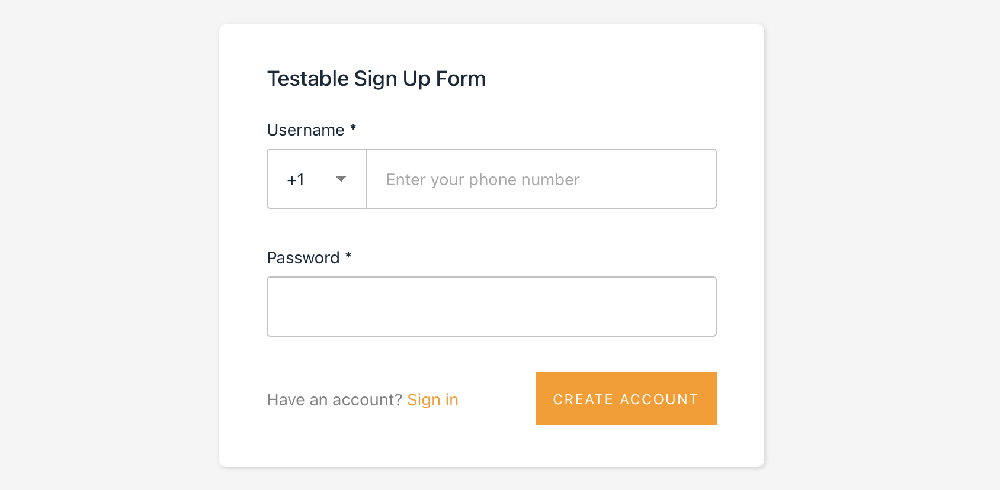

# SMS OTP testing with NUnit, C# and Playwright

This examples demonstrates how to use the [MailSlurp C# library](https://www.nuget.org/packages/mailslurp/) and phone numbers to test user sign-up and OTP SMS code verification. 



It contains an NUnit Playwright test that loads a [demo application](https://playground-sms.mailslurp.com) and uses a MailSlurp phone number to sign up, receive an SMS verification code, extract the code, fill out the verification form, and complete user sign-up.

> **To get started see ./UnitTest1.cs**

## Key concepts
The important techniques in this test are:
- Fetching a phone number you created in the dashboard with the SDK
- Using the phone's number to sign up as a new user
- Using the WaitForContoller [WaitForLastestSms](https://csharp.mailslurp.com/api/mailslurp.Api.WaitForControllerApi.html) methods

> The [waitFor](https://docs.mailslurp.com/wait-for/) methods allow the test to wait until an expected SMS is received by your phone number. This means you don't need retry methods or timeout waits.

## Links
- [Testing techniques](https://docs.mailslurp.com/testing/)
- [PhoneController documentation](https://csharp.mailslurp.com/api/mailslurp.Api.PhoneControllerApi.html)
- [WaitForController documentation](https://csharp.mailslurp.com/api/mailslurp.Api.WaitForControllerApi.html)

## Run

```
dotnet restore
dotnet tool install Microsoft.Playwright.CLI
dotnet playwright install
```

## Test

> Set API_KEY environment variable or override the test with your [MailSlurp API key](https://app.mailslurp.com/)

### Windows
```
$env:API_KEY="your-api-key"; dotnet test
``` 

### Mac, Linux
```
API_KEY="your-api-key" dotnet test
``` 


